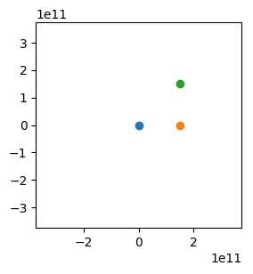

# cnbm
c-n-body-mini

A business card sized n-body code. Inspired by Tiny Ski and the business card raytracer.

To compile run:
```
gcc cnbm.c -o cnbm -lm -Wall
```

To run and plot (requires python3, matplotlib, numpy):
```
./cnbm > out.txt && ./p
```
To animate the plot use the animation flag:
```
./p -a
```
Default parameters have one Solar mass body and two Jupiter mass bodies interacting. One of the Jupiter bodies gets two gravity assists from the other!


